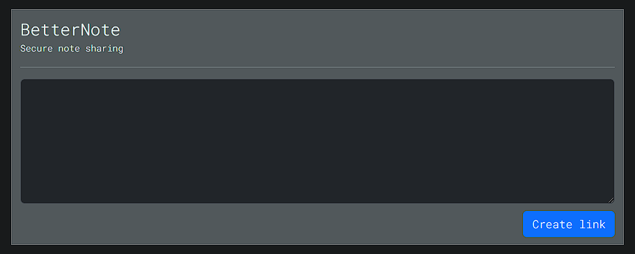

# betternote - Secure note sharing

### Screenshots

(Not much to show off, right?)

### Why?

Sometimes you just have to send that plain-text password to your friend or colleague, right? That's why this tool exists.

Server encrypts your data, saves it to Redis and you're left with one-time link with decryption key embedded into it!

Inspiration came from [dnote](https://github.com/smartboxgroup/dnote) project.

### Stack

**Made with dotnet, Redis, pure JS (with [aes-js](https://github.com/ricmoo/aes-js)) and ❤️.**

### Deployment

Intended to be deployed with docker-compose. This repo has two deployment configs:
- `docker-compose.yml` - default deployment config
- `docker-compose-customnet.yml` - deployment with custom external network (Portainer deployment)

### Deployment: HTTP vs HTTPS

You probably should deploy this service with a [reverse proxy](https://docs.nginx.com/nginx/admin-guide/web-server/reverse-proxy/) of some kind that will provide HTTPS.
Hosting this page on HTTP will not only decrease security but also forces frontend to use [outdated clipboard copy method](https://stackoverflow.com/a/72239825/12030195).

### Configuration

| Environment variable   | Meaning                                      | Default value         | Comment                                          |
|------------------------|----------------------------------------------|-----------------------|--------------------------------------------------|
| ASPNETCORE_ENVIRONMENT | Server environment, better be left as it is. | `Production`          |                                                  |
| ASPNETCORE_URLS        | Interface bind URL with port                 | `http://0.0.0.0:5000` | Server will bind on all interfaces on port 5000. |
| RedisDatabaseId        | Redis database ID                            | `-1`                  |                                                  |
| RedisHost              | Redis hostname, without port (6379 expected) | `redis`               |                                                  |
| SecretExpiryInMinutes  | Secret expiry time, in minutes               | `720`                 | 12 hours                                         |

### Contribution

I would be glad! Please do.

### Attribution

This project uses [icon](https://www.flaticon.com/free-icon/memo_11003089) made by [pictranoosa](https://www.flaticon.com/authors/pictranoosa). Thank you!
